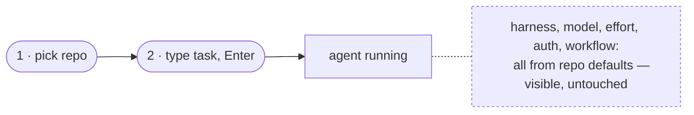
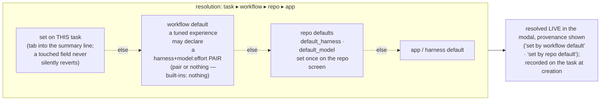

# Harness and model selection

**The governing principle: two actions to a running agent.** The repo governs everything;
overrides exist for you to see and change, but stay out of your way by default.

## How selection works today

A task records two opaque strings at creation — `harness` and `starting_model` — and the
control plane never interprets them; each harness gives them meaning.

- **Harness** (which agent CLI runs the container): explicit on the task ▸ the repo's
  `default_harness` ▸ claude. First match wins; the *resolved* name is recorded, so changing
  a repo default never re-routes existing tasks.
- **Model**: explicit `starting_model` ▸ the harness's own default. The string's vocabulary
  belongs to the harness — `opus` (claude), `gpt-5.6-sol` (codex), `provider/model` (pi), or an
  Outfitter **agent slug**. An Outfitter agent owns provider, model, thinking, skills, and
  extensions, so Panopticon does not split or reinterpret that slug.
- **Reasoning effort** rides the same string as a suffix — `gpt-5.6-sol:high` — translated
  per CLI (codex: `--config model_reasoning_effort`; pi natively reads `model:thinking`).
  One stored string, no schema growth per dimension.
- **Credentials** come from the repo: `env_file` (API keys, non-rotating tokens) and
  `credential_dir` (shared rotating credentials, e.g. a ChatGPT subscription auth.json).
  See [auth.md](./auth.md).

## Quickstart: detect, confirm, go

`panopticon quickstart` probes every registered harness without making the control plane choose
for you. For each adapter it checks whether the adapter's host CLI is on `PATH` and calls that
adapter's `missing_auth(environ, home)` check. It prints the evidence before prompting.

The recommendation order is: an installed, already-authenticated harness; any installed harness;
then Claude guidance when none is installed. One installed candidate needs only Enter to confirm.
Several produce a numbered picker with `authed`, `installed`, or `not installed` status and the
adapter's install hint. The choice becomes the repo's `default_harness`; quickstart deliberately
leaves `default_model` unset because task creation owns model choice.

`panopticon doctor` follows the same registry: it reports one line per harness CLI and requires at
least one, rather than requiring Claude specifically.

## Default resolution

- **Workflow defaults are a pair or nothing** — `default_harness` + `default_model:effort`
  declared together, or neither. A bare model with no harness scope can land on a CLI that
  doesn't speak it (the opus-on-codex bug class). Built-in workflows declare nothing, so a
  pair only ever exists because an operator tuned one — naming a harness they use and auth.
- **Defaults are never locks.** The new-task modal shows one summary line —
  `codex · gpt-5.6-sol · high (set by repo default)` — resolved live; tab into it to
  override. Provenance is load-bearing with four sources, not decoration.
- **Touch-protection is draft-scoped.** A field the operator touched survives workflow
  re-selection within the open draft, and exactly that long — a fresh modal always resolves
  from the chain. There is no cross-task "last selected" memory.
- **No navigation loses typed input.** Unsent drafts (memo + touched picker state) persist,
  so in-context jumps (create a profile, edit repo defaults) are safe.
- **Per-harness pickers are advisory.** Each harness supplies suggested models/efforts and
  its field label as static adapter data; free text is always valid; nothing validates
  vocabularies centrally. pi's list can come from its native `pi --list-models`. An
  outfitter harness labels the field **agent** — an agent slug subsumes
  provider + model + thinking + loadout, which is where local models arrive without the
  control plane learning anything about providers.

## Ownership

| Layer | Owns | Where set |
|---|---|---|
| **Task** | override of harness / model / effort | task modal |
| **Repo** | `default_harness`, `default_model`, `env_file`, `credential_dir` | quickstart / repo screen |
| **Workflow** | lifecycle + skills; *optional* tuned harness+model pair | workflow code |
| **Harness** | vocabulary, suggestion lists, field label, CLI mechanics | adapter code |

## RFC 2119 reviewer selection

The built-in 2119 workflows separately resolve two reviewer harness/model pairs for their final
dual review. These do not change the task's interactive harness or `starting_model`:

- `2119-human-spec` and `2119-auto-spec` default to
  `claude:claude-fable-5` plus `codex:gpt-5.6-sol`.
- `2119-auto-sol` retains two `codex:gpt-5.6-sol` defaults.
- A repo env file may independently override those slots with
  `PANOPTICON_2119_REVIEWER_1=<harness>:<model>` and
  `PANOPTICON_2119_REVIEWER_2=<harness>:<model>`.

The pair splits only at its first colon. The remainder is the harness-owned opaque model string,
consistent with task model selection. Both pairs are validated before either reviewer runs.
Reviewer output is accepted only after its machine-recorded responding model exactly matches that
requested string; aliases are not canonicalized.

## Outfitter adapter

Outfitter 1.16.0 is registered and selectable. Because quickstart detection iterates the registry,
an installed Outfitter CLI appears in onboarding. `setup-repo` routes authentication through Pi
and prepares `<credential_dir>/outfitter/.agents` as the catalog source mounted into tasks.

The harness writes `~/.agents/settings.yml` with its generated local source first and adds the
credential catalog when present. Populate `<credential_dir>/outfitter/.agents/agents/<slug>/agent.md`
and its referenced resources, then set the task's `starting_model` to the selected agent slug.
Panopticon does not fetch catalog sources inside a task; synchronize or populate that mounted
catalog before launch.

Outfitter launches pi underneath, so authentication is pi authentication: provider environment
variables work as they do for pi, and a repo `credential_dir` may supply pi's `auth.json`.
Outfitter builds a temporary composite Pi config and seeds it from `~/.pi/agent/auth.json`.
Bootstrap links the credential-dir file at that native fallback without overwriting existing
state. Panopticon operations are rendered as authenticated REST skills because Pi does not expose
an MCP client.

Panopticon launches Outfitter interactively in tmux. The normal launch inherits the tmux TTY and
passes the workflow turn extension and rendered skills through to Pi.

## Targeted mutation review

Killing a targeted mutation shows that an affected test can fail under that change; it does not
prove that the test failed for the intended reason, because an unrelated assertion can also kill
the mutation.

Every review body uses the exact `## Targeted mutation evidence` heading and records the
classification inside that section as an exact `Outcome: killed` or `Outcome: survived` line.

Before classifying a mutation as killed or survived, the reviewer verifies through an imported
module path or equivalent runtime evidence that the affected tests execute the mutated code from
the throwaway copy rather than the task working tree or another installed copy.
This guard exists because a copied source tree can still resolve an editable installation back to
the original checkout, producing a confident but false survivor when the mutated file never ran.

The Sol-only workflow makes two independent fresh-context dispatches of the same model. That
preserves independence from the author and between review contexts, but it does not provide
cross-model diversity; each dispatched reviewer chooses its own mutation.
